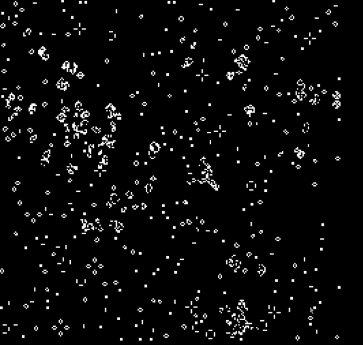

# Conways Game of Life:

## A Parallel implementation of the popular "Zero player game"

The Game of Life, also known simply as Life, is a cellular automaton devised by the British mathematician John Horton Conway in 1970. It is a zero-player game, meaning that its evolution is determined by its initial state, requiring no further input. One interacts with the Game of Life by creating an initial configuration and observing how it evolves. It is Turing complete and can simulate a universal constructor or any other Turing machine.


To view a demo, compile using CMake and then run the output binary with the following arguments (as an example):

 ```shell
 conwayGOL --rows 250 --columns 250 --screenWidth 1080 --screenHeight 1080 --percentage 10
 ```
 
 To view all possible options and their descriptions:
 ```
 conwayGOL --help
 ```
 
 This implementation uses a random seed based on the percentage defined by the user (otherwise taken as 15% as default). Based on this seed, the rest of the simulation ensues.
 

That will give something like this:




**NOTE:** This branch is the Non-CUDA version. This uses regular OpenMP parallelization for speed ups.
